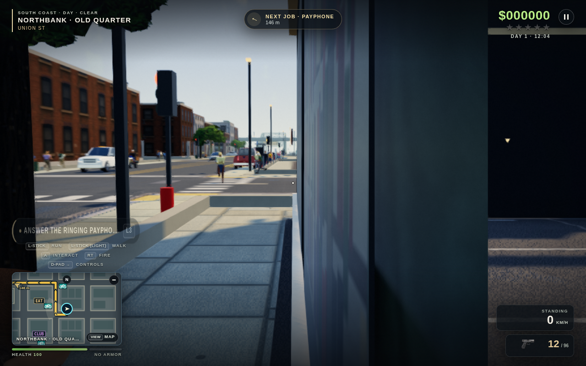
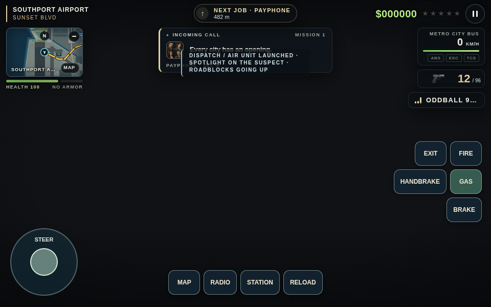
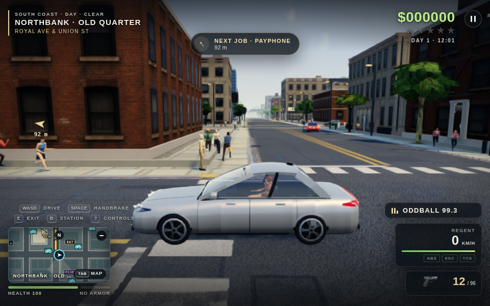
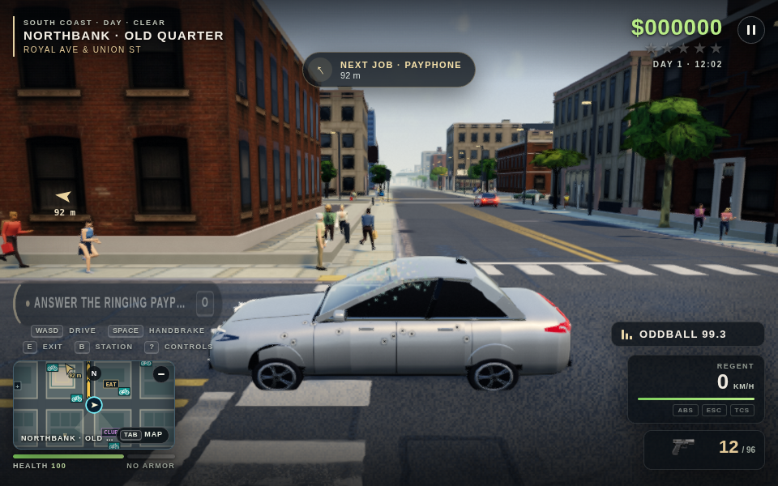

# Game review screenshots — 2026-10-10

Original screenshots captured during the review; no game fixes are included.
Captured in headless Chromium with software rendering.

## 1. Chase camera obstructed near a wall while aiming

## 2. Dispatch text overlaps the mission card in touch mode

The blank game background is intentional: this reproduction tests the HUD with world rendering disabled.

## 3. Vehicle window before and after breaking

The intact window reveals the driver; the broken window becomes an opaque black pane.

### Intact

### Broken

